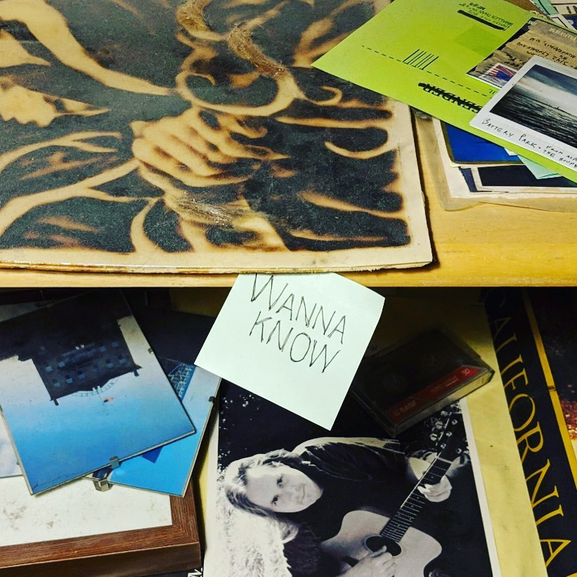

Well, it happened again. I set up a new blog, I got it looking mostly the way
I want, and then
suddenly I was too busy to write any new posts.
So here it is, my week in review, a
month later. 

---

## arts

The big news in my arts community is that [HUGE Theater,][huge] my
beloved second home, is buying a building! The current building is too
small to keep up with the demand for classes, rehearsal space, audience
attendance, and the business of running a theater. The new building
will give us space for all of that, and buying it will make that
space permanent. It'll also let us stop paying rent to a white
supremacist. Long story. 

HUGE has launched a capital campaign to make its down payment by
September 1. That's a scary prospect for a scrappy nonprofit theater
that doesn't know a lot of idle millionaires, and we need all the
help we can get. If you're interested in this at all, please
[read more about the move][hugemove] and [consider a donation.][hugeleap]    

---

<figure>
  
  <figcaption>Bummertown USA. Photo by <a href="http://www.adamiversonphotography.com">Adam Iverson.</a></figcaption>
</figure>

This winter I decided to pull back on arts projects so I could focus
on reinvigorating my code career. But then a number of things came
along that were hard to say no to, or easy to say yes to, and now
all those yesses are coming home to roost. For starters:

- [THE PAiNTERS,][painters] an improv group that does all painting,
  no scenes, has already begun its June-July run at HUGE Wednesdays.
  This Saturday we're also playing at [Improvocation,][improvocation]
  a show where three different groups will bring their unique takes
  on stories told by comedian [Elizabeth Ess.][ess] 
- I'm in rehearsal for [Bummertown,][bummertown] comedic improv
  that isn't afraid of sadness. I'll be accompanying
  the show on electric guitar, this July and August at HUGE.       
- I'm also working on music for <cite>Peer Gynt,</cite> a new work
  inspired by Henrik Ibsen's seven-hour Danish verse play (and the
  folk tales he drew on). [Impossible Salt's][impossible salt] version
  will be much,
  much shorter, with as few words as possible, rhyming or otherwise.
  We may still
  visit [the hall of the mountain king,][mountain-king] though.

More info and links, as always, on my [shows page.][shows page] 

---

Also, I [shot a photo][wanna-know-instagram] for an album that came out TODAY.
[Beastie Y'all][beastie] wrote a song about reflecting on the
past, and I wasn't sure what I was going
to do for it until I noticed the corner of my room that had already
become a shrine to my own past lives in past places, and I was like,
hm, a little on the nose, life. Anyway, [check out the song!][wanna-know]

---

## code
     
This month I've been working on a Rails codebase that was started eight years
ago, in another country, with a different purpose than it has now. That is,
it was created with one goal in mind, and then some people adapted it
to serve a different goal, and some other people adapted it further,
and I was hired to make it serve a new purpose again. By this point
over half the code in the repository was there to support functionality
that my client no longer has any intention of using.

That code wasn't hurting anybody... except that it was making the app
a little slower than it should be, and it was making development
substantially slower than it had to be. Especially now that I, a new
developer, was trying to understand the application and develop new
features without breaking anything – which meant that I was tiptoeing
around trying not to disturb code that, it turned out, we had no need
for anymore. That's a waste of time.  

So a lot of my work lately has been:
- figuring out what this
application does in 2019, and which parts of the code actually
do it
- updating the platform and tools it relies on
- replacing
and simplifying code that's antiquated
- crucially, writing tests
to help us notice when we break the functionality we care about
- and, ultimately,
deleting most of the code that we don't need anymore, so that
nobody who works on the application after me has to look at it
again. 
   
Before I started all this, I thought I would take careful notes on my
process and then write a blog post about it that was so helpful to
other spelunkers in other codebases that it became *incredibly
popular* and got me a gig as resident programming pundit for MSNBC
or another major cable channel. But then I forgot to take notes,
so I guess it's back to the code mines for me.

---

Aside from that project, my freelance colleague Eric and I have started
formally mentoring a couple
of interns for [Software for Good.][sfg] (We are *freelance mentors.*)
I'll probably have more to say
later about what it's like to be a wise and trusted oldtimer. 

And I spent a day at the Eyeo Festival's
[Code+Libraries Summit,][code+libraries] which I'd signed up for months
ago because (a) I code, (b) I like libraries, and (c) I couldn't justify
the cost of a full Eyeo ticket. I learned some things but the only time I
didn't feel like an imposter was when a bunch of us got tricked into
spending half an hour playing improv games together. 

---

## life

Minneapolis in the summer is pretty great. I've been busy, but
I've still managed a few bike outings to places like:

- [The Bakken Museum,][bakken] of medical technology, medicinal plants,
  and Frankenstein's monster – a hangout with my group [STEMprov] and
  a lucky auction winner.   
- [The Depot] in far Hopkins, for the debut of [The Buzz,][The Buzz]
  a new midday improv show. This is the farthest west I've ever biked,
  except when I lived in San José, which was cheating.
- [The Irreverent Bookworm,][the irreverent bookworm] a brand new
  bookstore in South Minneapolis, currently open only occasionally
  on weekends.
 
And a few weekends from now I'm looking forward to
[CONvergence,][convergence] a science fiction and fantasy convention in
downtown Minneapolis. I always feel a bit out of place – I'm just barely
a science fiction fan at this point – but I always go, and I'm always
glad I went. Life is like that sometimes, I guess. 

[sfg]: https://www.softwareforgood.com/
[code+libraries]: http://eyeofestival.com/summit/

[HUGE]: http://www.hugetheater.com/ 
[hugemove]: http://www.hugetheater.com/donate/hugemove/
[hugeleap]: http://www.hugetheater.com/donate/capcam/
[painters]: https://www.facebook.com/ThePaintersImprov    
[ess]: https://www.elizabethess.com/
[improvocation]: https://www.facebook.com/events/2296702307209088/
[bummertown]: https://www.facebook.com/bummertown/
[impossible salt]: https://www.impossiblesalt.org/
[mountain-king]: https://www.youtube.com/watch?v=kLp_Hh6DKWc
[shows page]: https://www.erikostrom.com/arts/shows
[beastie]: https://beastieyall.bandcamp.com
[wanna-know-instagram]: https://www.instagram.com/p/Byx5yWwniD-/
[wanna-know]: https://beastieyall.bandcamp.com/track/wanna-know  

[bakken]: https://thebakken.org
[stemprov]: https://www.facebook.com/STEMprovMN/
[the irreverent bookworm]: https://irrevbooks.com
[The Depot]: http://www.thedepotcoffeehouse.com
[The Buzz]: https://www.facebook.com/TheBuzzImprov/
[convergence]: http://www.convergence-con.org
